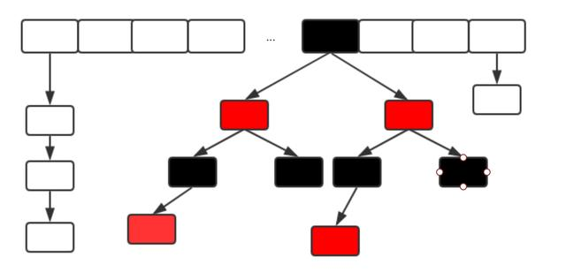

## 1. 哈希表

### 1.1 介绍

哈希表是一种key-value存储数据的结构，根据key即可查到对应的value。
如果所有的键是整数，我们可用简单的无序数组来表示，键作为数组索引，值即为对应的值

### 1.2 链式哈希表

链式哈希表本质由一组链表构成。每个链表可以看作一个桶，将键传入哈希函数(该过程称为哈希键)，函数通过散列的方式告知元素属于哪个桶，然后在相应的链表头插入元素。查找与删除，以同样的方式先找到桶，然后遍历链表得到想要的元素。
由于每个桶都是一个链表，所以链式哈希表不限制元素的个数，但是，如果表变的特别大，则性能会降低


### 1.3 应用场景

缓存技术（redis、memcached）在内存中维护一个巨大的哈希表，还有HashMap、ConcurrentHashMap

## 2. ConcurrentHashMap与HashMap等的区别

**HashMap**

HashMap线程不安全，在多线程情况下，执行HashMap的put操作会引起死循环，导致CPU利用率接近100%

**HashTable**

HashTable相对于HashMap不允许key、value为空
HashTable是线程安全的。但其线程安全策略代价太大，对整个Map上锁，只有一个线程能访问与操作该Map, 多线程竞争激烈的情况下，性能会非常差

**ConcurrentHashMap**

Map一般都是数组+链表结构（JDK1.8改为数组+红黑树）


ConcurrentHashMap避免了全局加锁而改用局部加锁，极大的提高了并发环境下的操作速度；
大量的使用了volatile、final、CAS等lock-free技术来减少竞争对性能带来的影响

## 3. JDK1.7 1.8的ConcurrentHashMap实现原理

**JDK1.7 ConcurrentHashMap实现原理**

在JDK1.7中ConcurrentHashMap采用数组+Segment+分段锁的方式实现

### 3.1 Segment(分段锁)

ConcurrentHashMap中的分段锁称为Segment.它类似HashMap的结构，内部拥有一个Entry数组，数组中的每个元素又是一个链表，同时又是一个ReentrantLock(Segment继承了ReentrantLock)

### 3.2 内部结构

Concurrent使用分段锁机制，将数据一段一段的存储，然后给每一段数据加锁，当一个线程占用锁访问其中一个段数据的时候，其他段的数据可以被其他线程访问，能够实现真正的并发访问。


由图可见，ConcurrentHashMap定位一个元素需要经过两次hash过程：第一次定位到Segmnent,第二次定位到元素所在的链表的头部

### 3.3 该结构的优缺点

缺点：Hash的过程要比普通的HashMap要长
优点：写操作时只对元素所在的Segment进行加锁即可，不会影响到其他Segment,在最理想的情况下,ConcurrentHashMap可以最高同时支持Segment数量大小的写操作（写操作非常平均的分布在所有Segment上）。所以，通过这种结构，ConcurrentHashMap并发能力大大提高。


**JDK1.8 ConcurrentHashMap实现原理**

1) JDK8中ConcurrentHashMap的实现参考了JDK8中HashMap的实现，采用了**数组+链表+红黑树**的实现方式，内部大量采用**CAS操作**。

CAS是compare and swap的缩写，即比较并交换。CAS是一种基于锁的操作，而且是乐观锁。在JAVA中分为乐观锁与悲观锁，悲观锁将资源锁住，等释放后下一个线程才可以进行访问，而乐观锁采用一种宽泛的方式进行处理，通过某种方式不加锁来处理资源，比如通过给记录加version来获取资源，性能较悲观锁有很大提高。
CAS操作包含三个操作数--内存位置(V)，预期原值(A)和新值(B), 如果内存地址里的值与A相同，则将值更新为B。CAS是通过无限循环来获取数据的，如果在第一轮循环中，a线程获取地址里的值被b线程修改了，呢么a线程需要自旋，到下次循环时才有可能执行

2) JDK8中彻底放弃了Segment转而采用Node,其设计思想不在是JDK7中分段锁的思想

Node: 保存key,value和key的hash值的数据结构，value与next都用volatile修饰，保证了并发的可见性

``` bash
static class Node<K,V> implements Map.Entry<K,V> {
    final int hash;
    final K key;
    volatile V val;
    volatile Node<K,V> next;
    //... 省略部分代码
}
```

3）JDK8中ConcurrentHashMap在链表的长度大于某个阈值(默认为8)的时候会将链表O(n)转化为红黑树O(logN)进一步提高查找性能



## 4 总结

**数据结构** JDK7采用数组+Segment的段锁的数据结构，JDK8采用数组+链表+红黑树的数据结构
**线程安全机制** JDK7采用Segment分段锁实现线程安全，其中Segment继承ReentrantLock. JDK8采用CAS+synchronized保证线程安全
**锁的粒度** JDK7对Segment进行加锁，JDK8对数组中每个元素(Node)加锁
**查询时间复杂度** 遍历链表O(N), 红黑树(O(logN))

ps: 参考 http://youzhixueyuan.com/concurrenthashmap.html