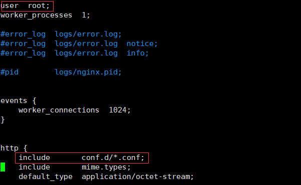

默认读者已经安装好docker

推荐使用docker-compose方式进行容器运行

# 1. 安装docker-compose

``` bash
pip install -U docker-compose
```

安装后查看版本`docker-compose version`

# 2. 下载nginx

``` bash
docker pull nginx:stable-alpine # 建议下载稳定版本
```

# 3.编写docker-compose.yml文件

我所创建文件位置为/opt/nginx/docker-compose.yml(docker-compose.yml文件名不可更改,否则docker-compose命令无法识别)

``` yml
version: '2'
services:
  nginx:
    container_name: nginx # 命名容器名称,便于容器管理
    image: nginx:stable-alpine # 刚才下载的nginx镜像
    network_mode: host
    restart: always 
    volumes: # 目录挂载
      - /opt/nginx/nginx.conf:/etc/nginx/nginx.conf 
      - /opt/nginx/conf.d:/etc/nginx/conf.d
      - /opt/nginx/cert:/etc/nginx/cert 
      - /opt/nginx/html:/usr/share/nginx/html
      - /var/log/nginx:/var/log/nginx
    ports:
      - "80:80"
    environment:
      - NGINX_HOST=47.74.188.157
      - NGINX_PORT=80
```

# 4.下载并修改本地/opt/nginx/nginx.conf文件

在docker-compose.yml同级目录/opt/nginx下下载nginx.conf文件

``` bash
wget https://github.com/nginx/nginx/blob/master/conf/nginx.conf
```

修改配置文件

``` bash
user root; # 第2行#user nobody修改为user root; 表示以root权限读取本地目录，否则报403错误

include conf.d/*.conf; # 第16行新增该配置文件,便于多域名配置实现(下面很快说到)

server_name  47.74.188.157 # 第37行左右修改server_name localhost 为本机IP地址

```
详情如图所示 

# 5.配置域名conf文件

在/opt/nginx/conf.d目录新建文件shenjian.online.conf,如果有其他域名，则在该目录下新建即可，如996icu.online.conf

shenjian.online.conf 配置如下：

``` bash
 server {
        listen       80;
        server_name  www.shenjian.online; # 所要使用的域名

        location / {
           root /usr/share/nginx/html; # 非/opt/nginx/html本地目录，而为docker容器nginx映射目录
        }
 
}

# 相关配置请查看具体证书提供商如阿里云配置说明
server {
	listen 443 ssl;
	server_name www.shenjian.online; # localhost修改为您证书绑定的域名。
	ssl_certificate cert/shenjian.online.pem;   # 将domain name.pem替换成您证书的文件名。
	ssl_certificate_key cert/shenjian.online.key;   # 将domain name.key替换成您证书的密钥文件名。
	ssl_session_timeout 5m;
	ssl_ciphers ECDHE-RSA-AES128-GCM-SHA256:ECDHE:ECDH:AES:HIGH:!NULL:!aNULL:!MD5:!ADH:!RC4;  # 使用此加密套件。
	ssl_protocols TLSv1 TLSv1.1 TLSv1.2;   # 使用该协议进行配置。
	ssl_prefer_server_ciphers on;   
	location / {
		root /usr/share/nginx/html; # 非/opt/nginx/html本地目录，而为docker容器nginx映射目录
		index index.html index.htm;  
	}
}
```

# 6. 证书文件导入(无则忽略)

新建目录,证书放置/opt/nginx/cert下

# 7. 放置静态资源文件服务器

新建目录/opt/nginx/html，在目录下新建html文件，输入经典Hello World保存

# 8. 运行并验证nginx

在docker-compose.yml同级目录下运行

``` bash
docker-compose up -d # 以后台进程方式运行

docker container ls # 查看容器nginx是否成功运行，若失败 `docker-compose logs` 查看失败原因

docker-compose down # Stop and remove containers, networks, images, and volumes
```

浏览器输入 www.shenjian.online , 经典的Hello World再次出现~~~~

# 9. 目录结构相关图片


