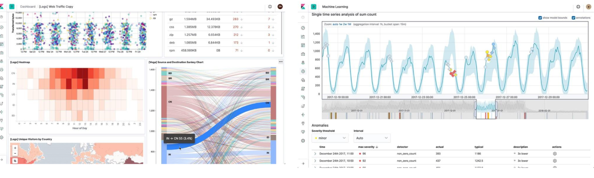
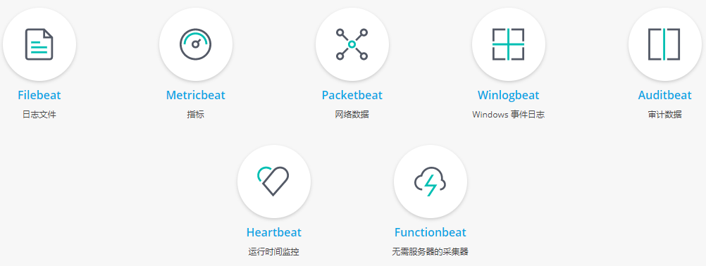
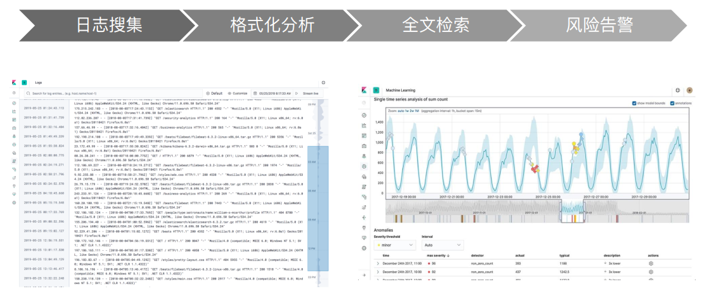

## 1. Elastic Stack生态圈

## 2. Logstash:数据处理管道

### 2.1 简介

+ 开源的服务器端数据处理工具，支持从不同来源采集数据，转换数据，并将数据发送到不同的存储库中
+ 最初用来做日志的采集与处理

### 2.2 特性

+ 实时解析与转换数据
	+ 从IP地址中破译出地理坐标
	+ 将PII数据匿名化，完全排除敏感字段
+ 可扩展性
	+ 200多个插件(日志/数据库/Arcsigh/Netflow)
+ 可靠安全性
	+ Logstash通过持久化队列来保证至少将运行中的事件运行一次
	+ 数据传输加密
+ 监控

## 3. Kibana:可视化分析利器

## 4. BEATS:轻量的数据采集器

## 5. ELK应用场景

+ 网站搜索、垂直搜索、代码搜索
+ 日志管理与分析、安全指标监控、应用性能监控、WEB抓取舆情分析

### 5.1 搜索型业务场景

+ 单独使用Elsticserch存储(不推荐)
+ 以下情况下课考虑与数据库集成
	+ 与现有系统的集成
	+ 需考虑事务
	+ 数据更新频繁

### 5.2 日志型业务场景

#### 5.2.1 日志管理

#### 5.2.2 指标分析、日志分析

#### 5.2.3 安全分析:集成ArcSight

