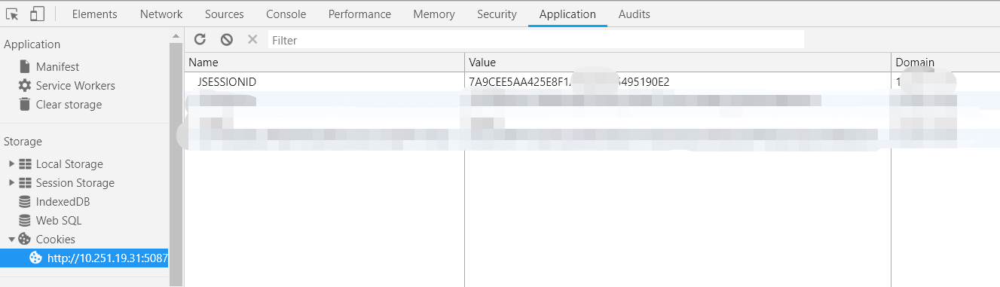

### 1. 需求描述

每月定时从第三方系统获取excel报表(报表内容格式较为复杂)，留痕解析落地数据库

需求涉及到的开发过程如下：
1）登录第三方系统(已提供url、username、password及js jsonp方式登录demo)
2）url方式获取财务报表(已提供报表url)保存至服务器按月建立文件夹存储进行留痕
3）excel解析落地数据库临时表

### 2. 分析过程

采用jsonp方式登录缺点： 需js实现定时；需js实现资源获取与保存，由于js知识欠缺且个人认为js实现不如java方式简便便于管理

我们知道，系统登录成功后，**服务器会返回给浏览器一个JSESSIONID用于用户再次访问时的身份凭证**，删除该JSESSIONID后再次访问则重定向到登录页面。



### 3. 解决方案

``` bash
package online.shenjian.jsonp;

import com.alibaba.fastjson.JSONObject;
import org.apache.commons.httpclient.HttpClient;
import org.apache.commons.httpclient.methods.GetMethod;
import org.springframework.http.*;
import org.springframework.web.client.RestTemplate;

import java.io.*;

/**
 * JAVA后台登录获取数据
 */
public class JsonpLogin {

    public static void main(String[] args) throws IOException {
        RestTemplate restTemplate = new RestTemplate();

        String url = "http://ip:port/report/reportServer";

        JSONObject jsonObject = new JSONObject();
        jsonObject.put("username", "*");
        jsonObject.put("password", "*");
        String body = jsonObject.toJSONString();

        HttpHeaders headers = new HttpHeaders();
        MediaType mediaType = MediaType.parseMediaType("application/json; charset=UTF-8");
        headers.setContentType(mediaType);

        HttpEntity<String> entity = new HttpEntity<>(body, headers);

        ResponseEntity<String> responseEntity = restTemplate.postForEntity(url, entity, String.class);
        if (HttpStatus.OK.equals(responseEntity.getStatusCode())) {
            String cookieString = String.valueOf(responseEntity.getHeaders().get("Set-Cookie"));
            if (cookieString != null && cookieString.length() > 1) {
                cookieString = cookieString.substring(1, cookieString.length() - 1);
            }
            String address = "http://ip:port/webReport/reportServer?report=test.xlsx";

            HttpClient httpClient = new HttpClient();
            GetMethod getMethod = new GetMethod(address);
            // Cookie如不传递，服务器则认为为新请求，故下载内容后缀更改为html,会发现为登录页面
            getMethod.setRequestHeader("Cookie", cookieString);

            int statusCode = httpClient.executeMethod(getMethod);

            InputStream inputStream = null;
            OutputStream outputStream = null;
            try {
                if (statusCode == org.apache.commons.httpclient.HttpStatus.SC_OK) {
                    inputStream = getMethod.getResponseBodyAsStream();
                }
                File file = new File("/home/document/report/201902/test.xlsx");
                if (file.exists()) {
                    file.delete();
                }
                outputStream = new FileOutputStream(file);
                // 由于报表文件较小，不到M,不采用缓冲流(默认大小8M)
                byte[] bytes = new byte[1024];
                int size;
                while ((size = inputStream.read(bytes)) != -1) {
                    outputStream.write(bytes, 0, size);
                }
            } finally {
                if (inputStream != null) {
                    inputStream.close();
                }
                if (outputStream != null) {
                    outputStream.close();
                }
            }
        }
    }
}
```
