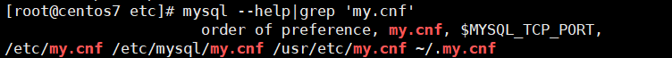
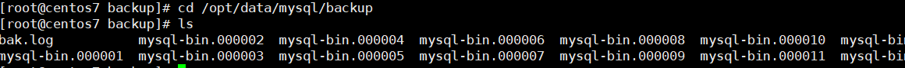
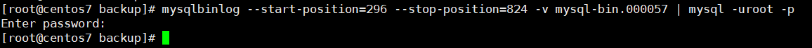

本文基于Centos7与Mysql7.5，其他系统版本可能操作存在差异

### 1. 检查并开启binlog

`SHOW VARIABLES LIKE 'log_bin%';`


**Centos7下Mysql配置my.cnf位置：** `ps aux|grep mysql|grep 'my.cnf'`, 如果没有没有输出内容则是使用默认配置位置
**默认配置my.cnf位置：** `mysql --help|grep 'my.cnf` 



顺序排前的优先,执行`vim /etc/my.cnf`编辑配置文件并新增配置如下图方框内容

```bash
log_bin=/var/lib/mysql/mysql-bin
server-id=12354
```


执行`systemctl restart mysqld.service`重启mysql
登录mysql，再次查看binlog，已经开启


进入/var/lib/mysql数据目录，可以发现，增量备份文件已经存在


### 2. 将增量文件定时备份到指定目录

#### 2.1 新增增量备份脚本 

在目录/var/lib/mysql下创建脚本mysqlIncreamBackup.sh，内容如下
注意：脚本中红色字注释表示需要根据实际情况更改

```bash
#!/bin/bash
backupDir=/opt/data/mysql/backup/ # 自定义备份目录，确保目录存在，不存在则创建
mysqlDir=/var/lib/mysql
logFile=/opt/data/mysql/backup/bak.log # 自定义文件
binFile=/var/lib/mysql/mysql-bin.index # 为mysql变量log-bin-index值


# 产生新的binlog.00000*文件
mysqladmin -uroot -pSj123456! flush-logs # 用户名密码请自行更改

# wc -l 统计行数(如显示12 binlog.index), awk '${print $1}'显示第一列(如12)
counter=`wc -l $binFile | awk '{print $1}'`
nextNum=0
for file in `cat $binFile` # file显示如./binlog.000009
do
    base=`basename $file` # base则显示为binlog.000009
    echo $base
    nextNum=`expr $nextNum + 1` # nextNum+=1
    if [ $nextNum -eq $counter ] # -eq 等于
        then
            echo $base skip! >> $logFile
    else
        dest=$backupDir/$base
        if(test -e $dest) # test -e 判断目标文件是否存在
            then
                echo $base exist! >> $logFile
        else
            cp $mysqlDir/$base $backupDir
            echo $base copying >> $logFile
        fi
    fi
done
echo `date +"%Y年%m月%d日 %H:%M:%S"` Bakup success! >> $logFile
```

#### 2.2 保存并授权脚本

执行`chmod 755 mysqlIncreamBackup.sh`授权脚本，使其具有执行权限

#### 2.3 定时执行

执行`crontab -e`进入定时编辑页面(测试设置每5分钟执行，根据具体需求设定)


crontab的格式为:
```bash
minute hour day month week command
```
+ minute：表示分钟，可以是从0到59之间的任何整数。
+ hour：表示小时，可以是从0到23之间的任何整数。
+ day：表示日期，可以是从1到31之间的任何整数。
+ month：表示月份，可以是从1到12之间的任何整数。
+ week：表示星期几，可以是从0到7之间的任何整数，这里的0或7代表星期日。
+ command：要执行的命令，可以是系统命令，也可以是自己编写的脚本文件

### 3. 备份结果查看



OK,至此备份成功！

### 4. 增量备份恢复

如不小心，在执行`DELETE FROM salaries`忘记加where子句，可通过增量备份文件进行恢复
执行命令如下，本次案例选取mysql-bin.000057，若情况紧急，可以手动执行脚本，及时查看备份文件

查看增量文件内容：`mysqlbinlog --base64-output=decode-rows -v /opt/data/mysql/backup/mysql-bin.000057`,mysql5.7中sql已加密，故需要--base64-output=decode-rows


可以查看到已经误删除salaries表中数据：


继续向前翻看文件,找到想要恢复的开始位置为结束位置


开始恢复296~824(注意起始位置为事务起始位置，可包含多个事务)间的插入与修改操作
`mysqlbinlog --start-position=296 --stop-position=824 -v mysql-bin.000057 | mysql -uroot -p`



恢复成功!，当然也可以根据开始时间，结束时间进行恢复，详见mysqlbinlog --help


