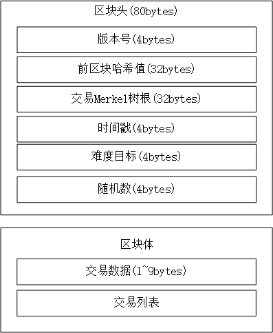

如图所示，区块链技术模型包括9大部分，其中7层基础技术层和2各贯穿整个7层的共用技术。

## 1. 数据存储层

区块链就像是一个个分布式账本，账本的账册通过链条链在一起，构成一连串的账本链(即区块链)。账本中的数据通过分布式方式(分布式文件系统或者分布式数据库)存储在不同节点。数据存储层主要包括**数据区块**的逻辑组织方式和使用**链式结构**与**Markle树**进行有效存储

### 1.1 数据区块

数据区块由区块头和区块体两部分组成。
区块头主要包括区块版本号、前一个区块的哈希值、用于验证区块交易的一个总的哈希Merkle树根、时间戳、难度目标及一个用于证明工作量难度的随机数。
区块体主要包含该区块的所有交易信息和所用交易信息的Merkle数(树根除外，树根存在区块头内)

### 1.2 链式结构

区块链应用的所有区块之间按照时间先后顺序链接成一个完整的链条。新创建的区块链接在最后一个区块后面。该单向链条被每个节点认可，有人想篡改几乎不可能，每一笔交易都可以向前溯源，找到其历史记录，具有安全和可验证性。

### 1.3 Merkle树及其基本原理

Merkle树是一种典型的二叉树或多叉树，他包含根节点、中间节点、叶子节点。根节点将保存在区块头中。根节点、中间节点、叶子节点是一组哈希值，叶子节点存储了该区块内的所有交易的初始哈希值，一个交易对应一个叶子节点。叶子节点两两哈希，得到上一层中间节点的哈希值，依次类推，得到根节点的哈希值。 只要有任一叶子节点的数据被修改了，则根节点哈希值一定会发生改变。因此，要判断区块体交易数据是否有修改，只需验证Merkle树的根节点即可。

## 2. 网络通信层

区块链运行在去中心化的分布式网络，一般采用P2P的组网方式。

### 2.1 P2P网络

P2P，即peer-to-peer，又称“对等网络”，直接交换来共享计算机资源和服务。

### 2.2 链接方式

当矿工生成一个有效区块后，且被其他矿工确认有效后，就可以链接到当前区块链的末尾，形成新的区块链主链。由于各计算节点以分布式并行计算来争取记账权的，所以可能会出现链条分叉的现象。
针对这种情况，区块链协议规定：当主链分叉时，计算节点总是选择链接到**当前工作量证明最大的分支**上，形成更长的新主链。

### 2.3 传播机制

比特币的传播机制可简述如下：
1）发起比特币交易的节点将自己新创建的交易数据向全网其他节点进行广播
2）所有的节点将收集这些新的交易数据，并打包至自己的预创建的区块中
3）为了争夺记账的权力，每个节点努力工作，找到一个工作量的难度证明(PoW)
4) 一旦找到了工作量的难度证明，立即对全网进行广播
5）其他节点如果认可该工作量难度最大同时所有交易有效，呢么认可该节点创建的区块有效
6）一旦新创建的区块得到认可，则其他所有节点都将接受该区块，并将该区块加入自己区块链条的最后一个区块后。

### 2.4 共识机制

比特币系统中区块链技术采用了基于PoW的共识机制。具体做法：在区块计算的最后一步要求解一个随机数，使区块的哈希函数值小于或等于某一目标哈希值，由于哈希函数的随机性和不可逆性，找到随机数的难度会很大。通常目标哈希值由多个前导0的数串构成。设置的前导零越多，目标哈希值设定的越小，找到符合随机数的难度就越大。比特币系统通过调整目标哈希值，通常将区块的时间动态控制在10分钟左右。

### 2.5 验证机制

基于区块链应用事先达成的各种验证协议来进行，比如交易的格式、交易的数据结构、格式的语法结构、输入输出、数字签名的正确性等。

## 3. 数据安全与隐私保护层

### 3.1 时间戳

基于‘去中心’的设计思路，没有一个具体的时间服务器，因此各个节点时间可能不一致。比特币区块链中规定各个节点不超过2小时的偏离。区块链中已各区块生成的顺序作为一个广义的时间戳服务，可以防止双重支付及溯源的作用。

### 3.2 哈希函数

哈希函数把输入数据按一定的算法计算出来，生成固定长度的摘要，即数字摘要。 数字摘要与输入数据一一对应，生成数字摘要容易，逆向计算出输入数据需要天文数字的计算量。

### 3.3 数据加密

**对称加密** 

**非对称加密**

对称密钥安全传递技术：数字信封（公钥加密，私钥解密）
数字签名防抵赖技术：（私钥加密，公钥解密）

### 3.4 零知识证明

零知识证明指证明者能够在不向验证者提供任何有用的信息的情况下，使验证者相信某一论断是正确的。
零知识证明实质上是两方或者多方的协议，即两方或者多方完成一项任务所需采取的一系列步骤。

### 3.5 区块链安全体系 

1）物理网络安全 2）区块链数据安全 
3）区块链应用系统安全 4）区块链密钥安全管理

### 3.6 隐私保护机制

交易信息或区块链
1）创建隐私保护算法 最典型 k-匿名算法 2）存储隐私保护算法
3）数据挖掘过程中隐私保护算法 4）用户使用过程中隐私保护算法

## 4. 共识层

### 4.1 工作量证明 PoW

Proof of Work基本思想是：通过完成一个有难度的任务来决定区块记账权。 一般来讲，任务的设计是很难计算答案的，但一旦知道答案，却很容易验证，而且难度还可以根据网上的算力来进行动态调整。

如给定一个字符串‘Hello World’,比特币应用给出的工作量要求是在其后加一个叫girl的数值，将新的字符串进行双重SHA-256哈希计算，如果得到的哈希结果(以16进制的形式表示)是以一定数量的0开头的，则验证通过。 工作量证明相当耗费算力，所以小矿工抱团取暖，加入矿池，按提供的算力进行分配所得

### 4.2 权益证明 PoS

PoS是点点币(PPC)最早采用的一种共识机制。PoS机制主要根据参与者手中持有代币的多少和时间长短(币龄)来决定出块记账权的概率，越多机会越大。
与PoW相比，优点能够大幅提高共识效率，降低共识成本，减少算力浪费。
缺点安全性比较差，节点可以低成本的分叉作恶，造成PoS公平性先天不足。

### 4.3 股份授权证明 DPoS

由于Pow与Pos的每个节点均可创建区块，这样共识节点多，效率相应差。DPoS是由被社区选举出来的可信账户(受托人)来创建，为了成为正式受托人，需要拉票，获取足够其他用户信任。
DPoS提高了传播效率，减少算力消耗，但存在可靠性与安全性隐患。

### 4.4 拜占庭容错机制

在确认共识是，结果并不代表大多数的人的意见。在已知有成员谋反的情况下，忠诚的将军在不受叛徒影响的情况下如何达成一致，拜占庭问题由此产生。