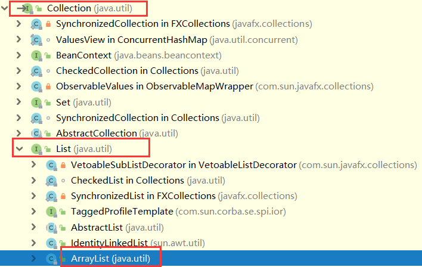

ArrayList基于数组，故需注意数组相关注意事项，详见 [数组](https://sjshenjian.github.io/2019/01/25/%E6%95%B0%E7%BB%84/)

首先我们看到ArrayList在集合中的位置如图



### 1. 几个重要的变量

数组默认容量大小为10，transient忽略数组被序列化

``` bash
private static final int DEFAULT_CAPACITY = 10; // 默认数组大小，也可构造器指定
transient Object[] elementData; // 存放元素
private int size; // 当前数组大小
```

### 2. 插入方法

首先保证数组容量是否足够，不够则使用grow()方法进行1.5倍扩容，modCount++以便迭代器遍历时其他线程进行不期望的修改时抛出ConcurrentModificationException，从而快速失败(fail-fast)

``` bash
public boolean add(E e) {
        ensureCapacityInternal(size + 1);  // Increments modCount!!
        elementData[size++] = e;
        return true;
}
```

``` bash
private void grow(int minCapacity) {
        // overflow-conscious code
        int oldCapacity = elementData.length;
        int newCapacity = oldCapacity + (oldCapacity >> 1); // 右移1位，扩容1.5倍
        if (newCapacity - minCapacity < 0)
            newCapacity = minCapacity;
        if (newCapacity - MAX_ARRAY_SIZE > 0)
            newCapacity = hugeCapacity(minCapacity);
        // minCapacity is usually close to size, so this is a win:
        elementData = Arrays.copyOf(elementData, newCapacity); // 底层采用Array.newInstance与System.arraycopy
}
```

### 3. 删除方法

index后数组拷贝至已index为头，已size-1为尾，数组中的最后一个非空元素置为null,以便垃圾回收

``` bash
public E remove(int index) {
	    rangeCheck(index);

	    modCount++;
	    E oldValue = elementData(index);

	    int numMoved = size - index - 1;
	    if (numMoved > 0)
	        System.arraycopy(elementData, index+1, elementData, index,
	                         numMoved); // 涉及数组的拷贝，时间复杂度为O(n)
	    elementData[--size] = null; // clear to let GC do its work

	    return oldValue;
}
```

### 4. 查找方法

``` bash
public int indexOf(Object o) {
	    if (o == null) {
	        for (int i = 0; i < size; i++)
	            if (elementData[i]==null)
	                return i;
	    } else {
	        for (int i = 0; i < size; i++)
	            if (o.equals(elementData[i]))
	                return i;
	    }
	    return -1;
}
```

### 5. 总结

ArrayList的插入不考虑扩容时间复杂度为O(1), 考虑扩容时间复杂度为O(n), 查找与修改时间复杂度为O(n)。
数据量大时，频繁的插入与删除会触发底层数组频繁的拷贝，效率低，还会造成内存空间的浪费。
