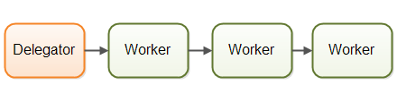
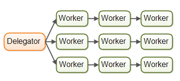

## 1. 并行工作者模型

### 1.1 简介

委派者会将传入的工作分配给不同的工作者，每个工作者完成整个任务。并发工作者模型是最常见的并发模型

### 1.2 优点

只需添加更多的工作者来提高系统的并行度

### 1.3 缺点

**共享状态可能会很复杂**  线程间数据共享意味着要处理好竞态、死锁等并发性问题

**工作者无状态** 共享状态能够被其他线程修改，所以工作者在每次需要的时候都要重新读状态，所以称为无状态

**任务执行顺序不确定**

## 2. 流水线并发模型

### 2.1 简介

每个工作者只负责作业中的部分工作，完成了会将作业转发给下一个工作者。 采用流水线并发模型的系统又称为反应器系统或者事件驱动系统。以下为其各个表现形式：

### 2.2 优点

**无需共享状态**

**工作者有状态**

**较好的硬件整合**

**合理的作业顺序**

### 2.3 缺点

作业被分布到多个工作者中，导致追踪某个工作到底被什么代码执行时变得困难。

## 3. 函数式并行模型

函数式调用的基本思想是采用函数调用实现程序。函数可以看作代理人，函数之间可以像流水线模型互相发送消息(通过函数间的互相调用实现)。

函数是通过拷贝来传递参数的，每个函数的执行类似原子操作，执行独立，互不影响。一旦可以独立运行，呢么可以在不同的CPU上进行过执行。

java.util.concurrent包中的ForkJoinPool可以实现函数式并行的一些东西。JAVA8中的stream能够并行的迭代大型集合。

跨CPU协调函数调用需要一定开销，要确定好并行的调用函数，其完成的工作单元可以弥补这个开销，否则，慎用！！

