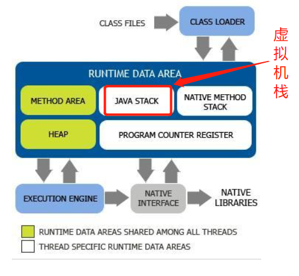
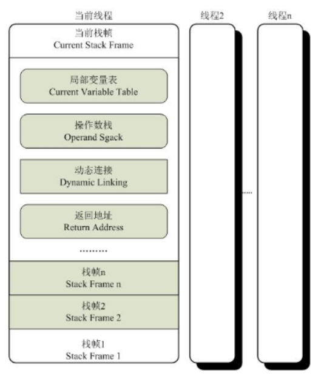

## 1. 虚拟机栈在运行时数据区位置

如图所示，JAVA虚拟机栈与本地方法栈及程序计数器为线程私有； 方法区与JAVA堆为线程共享，以上共同组成了运行时数据区。

## 2. 何为栈帧

虚拟机栈包含栈帧。 一个方法开始执行的时候同时会在栈空间中创建一个栈帧，一个方法的调用与执行完成对应一个栈帧的入栈与出栈

## 3. 栈帧结构

**局部变量表** 局部变量表以变量槽(slot)为最小存储单位。

存储类型：

- 基本数据类型： byte/boolean/char/short/int/float/long/double 由于每个slot只能存32位，故long/double需要2个slot存储
- reference类型: 
- returnAddress类型：

**操作数栈**

- 是一个先入后出的栈
- JAVA虚拟机的解释执行引擎称为"基于栈的执行引擎"，其中所指的栈就是操作数栈

**动态链接**

在运行时创建的直接引用称为动态链接。 每一个栈帧都包含有一个指向运行时常量池该栈帧所属方法的引用，该引用就是为了方法调用过程中的动态链接。

**返回地址**

方法开始后有两种方式退出：正常退出和异常退出

*正常退出：* 执行引擎遇到任意一个方法返回的字节码指令，如ftreturn、dreturn，可能有返回值返回给方法上一层调用者
*异常退出：* 无论是JAVA虚拟机内部的产生的异常，还是代码中使用athrow产生的异常，只要在本方法的异常表中没有搜索到匹配的异常处理器，就会导致方法退出。异常退出无返回值返回给方法上一层调用者。